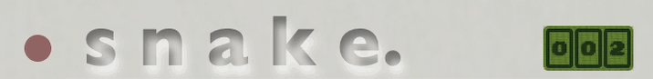
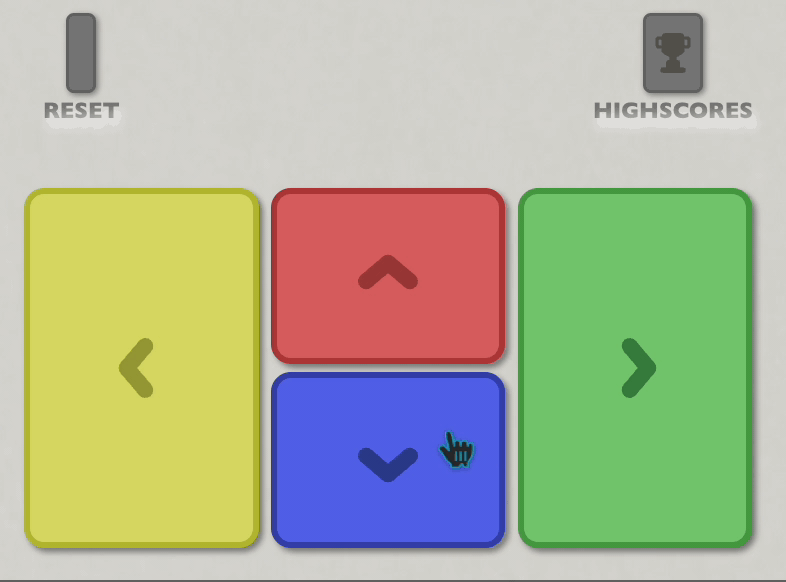

<!-- PROJECT LOGO -->
 

<h1 align="center">Snake</h1>

  

    A web recreation of the classic game Snake
     
    <a href="https://linktowebsite.com">View Live Demo</a>

<!-- TABLE OF CONTENTS -->

  
Table of Contents

  <ol>
    <li>
      <a href="#about-the-project">About The Project</a>
      <ul>
        <li><a href="#built-with">Built With</a></li>
      </ul>
    </li>
    <li>
      <a href="#react">React</a>
      <ul>
        <li><a href="#state">State</a></li>
        <li><a href="#game-logic">Game Logic</a></li>
        <ul>
            <li><a href="#drawing-grid">Drawing Grid</a></li>
            <li><a href="#drawing--moving-snake-in-grid">Drawing & Moving Snake in Grid</a></li>
            <li><a href="#snake-collision">Snake Collision</a></li>
            <li><a href="#random-food-spawn">Random Food Spawn</a></li>
      </ul>
      </ul>
    </li>
    <li><a href="#rails">Rails</a></li>
    <ul>
        <li><a href="#model">Model</a></li>
        <li><a href="#controller">Controller</a></li>
    </ul>
    <li><a href="#design">Design</a></li>
    <ul>
        <li><a href="#header">Header</a></li>
        <li><a href="#game-screen">Game Screen</a></li>
        <li><a href="#buttons">Buttons</a></li>
    </ul>
    <li><a href="#usage">Usage</a></li>
    <li><a href="#contact">Contact</a></li>
  </ol>

<!-- ABOUT THE PROJECT -->
## About The Project

This is a web recreation of the classic snake game, but when you get a highscore you can save it for the world to see. Using React inside of Rails.

### Built With
 - Rails
 - React
 - SCSS

## React

### State

#### **Snake**
the whole state of the project is revolving around the coordinates of snake, which are default 2 arrays inside of an array. I sparingly use States in the project only using it for what is needed to update every frame or so.  
I am also saving a string with useRef that is saying what direction the snake is facing which helps with moving it around.

#### **Food Coordinates**
The food cordinates are saved in a useRef so i dont loose the value of it with all of the other react data. getting the value using .current

#### **Grid**
For saving and updating the grid im using a useMemo because i want the grid to update everytime the Snake updates OR when food cordinates update. so i can propelry update the array that coordinates with the graph, inside the use memo i am drawing the grid everytime snake or food is updated.

(<a href="#readme-top">back to top</a>)

### Game Logic

#### **Drawing Grid**
Everytime snake updates the drawGrid function is getting called, which takes in snake coordinates, and food coordinates. It loops through the set Grid array and puts each one correspondingly. The first set in the snake array is drawn as the snake head, and the last is the tail. the rest of the array is placed as a snake body. and the food coordinates get placed as food.

#### **Moving & Growing Snake in Grid**
For moving the snake in the grid i remove the last value in the Snake Array and add another value to the first value. Determining which direction the snake is going the first or second spot in the new coordinates will be adjusted accordingly.  
For Growing the snake when a player eats food, i add a value behind the last one, growing the tail out by one. I did it from the back so it doesnt mess with the players movements.

#### **Snake Collision**
For Snake collisions im using functions inside of a useMemo, for snake to wall collision i am seeing if the head position in Snake Array ever is equal to 0 or 1, etc. depending on which wall. and if the direction is the one which it would run into it.
This is in a useMemo because i want to run checks everytime the snake moves if it ran into something.
The Snake to food collision is practically the same as the rest but only seeing if the Snake Head value is equal to the food Coordinates, and if it is then it grows the snake by one

#### **Random Food Spawn**
Food is spawned randomly on the grid and will keep trying to spawn if it failed because snake was in that position. Food cannot be spawned on the snake.

(<a href="#readme-top">back to top</a>)

## Rails

### Model
i wanted to save the highscores in a classic arcade way. (3 letter save no login) so all im saving in rails is a PlayerScore model which saves the 3 letter string. and the players score which is saved inside a hidden value in forms so the user cant manipulate it on screen.
When submit i save a fake value over React that shows ur score right away without a refresh. When user refreshes/reloads the real score replaces the fake score that was just saved.

### Controller
In the controller i am taking all saved highscores and ordering them by value, and sending that back to react so i can then show the user a ranked highscore in order.

i also am creating new PlayerScores over params, and saving when the user submits the form.

### Gems
The most important gem im using in this project is  
`gem react-rails`  
This is one out of two React gems but i find this one works better and adds less of a hassle to set it up.

(<a href="#readme-top">back to top</a>)

## Design

### Header
for the Title header i wanted to go for a engraved Gameboy type of title so i added a shadow inside of the text making it look more indented with a blinking red light to the right of it  

I also added a point cointer in the top right to fill up space and it updates when a User gets more points

### Screen
For the screen i added a screen texture over the square div. This works out really well to emulate a older screen texture. and i made the background a shade of green that is also the color of old gameboy screens and basing the rest of the colors around a darker green scale.  
the Food is bright white and glows trying to make it more obvious that its what the goal of the game is

#### **Animations**
Most animations are being run on steps to make it not smooth on purpose with the whole emulation feel i was going for. Text animation growing and shrinking, or colors going back and forth

### Buttons
For the buttons i made them bigger so its easier to click if user isnt using the arrow keys. The colors are based off of how older generation game controllers had this color scheme of buttons, For the clicks i remove the background shadow and scale it down slightly to create the illusion of a actual button going down.

(<a href="#readme-top">back to top</a>)

<!-- USAGE EXAMPLES -->
## Usage

To play snake click anywhere on the screen to start, or any button. When started you can use the on screen buttons to move around or the arrow keys on your keyboard.  
Eat the squares to grow and try not to run into yourself or any walls.

<!-- CONTACT -->
## Contact

**John Farina** - johnfarina8@gmail.com

Project Link: [github.com/john-farina/snake-port](https://github.com/john-farina/snake-port)

(<a href="#readme-top">back to top</a>)

